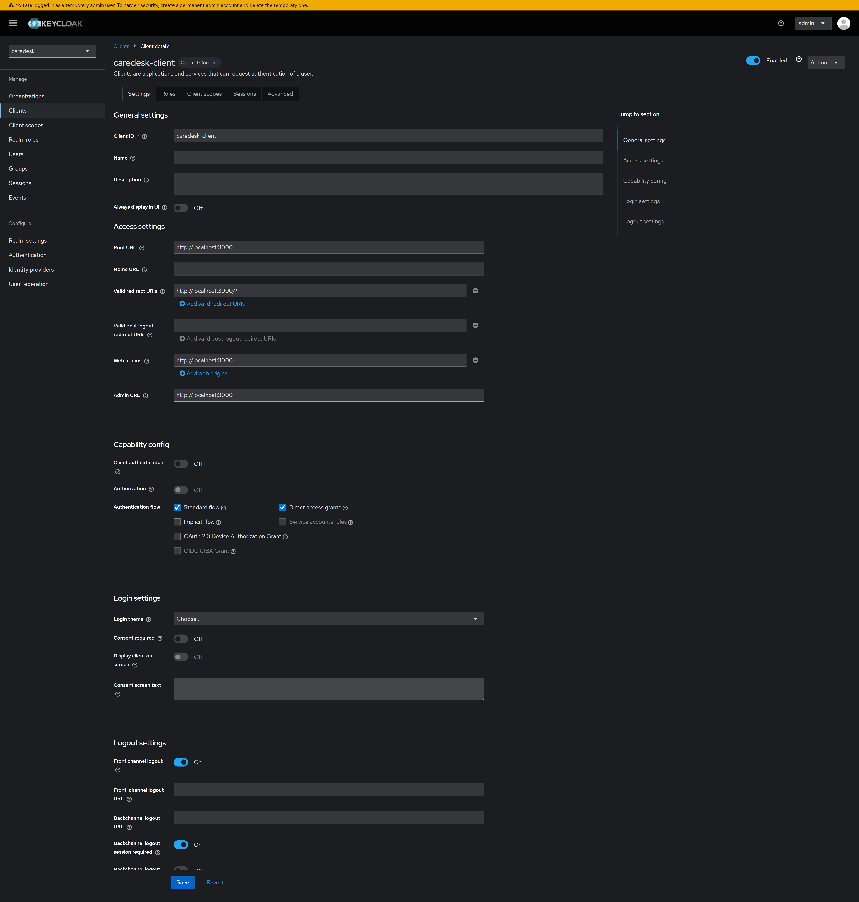
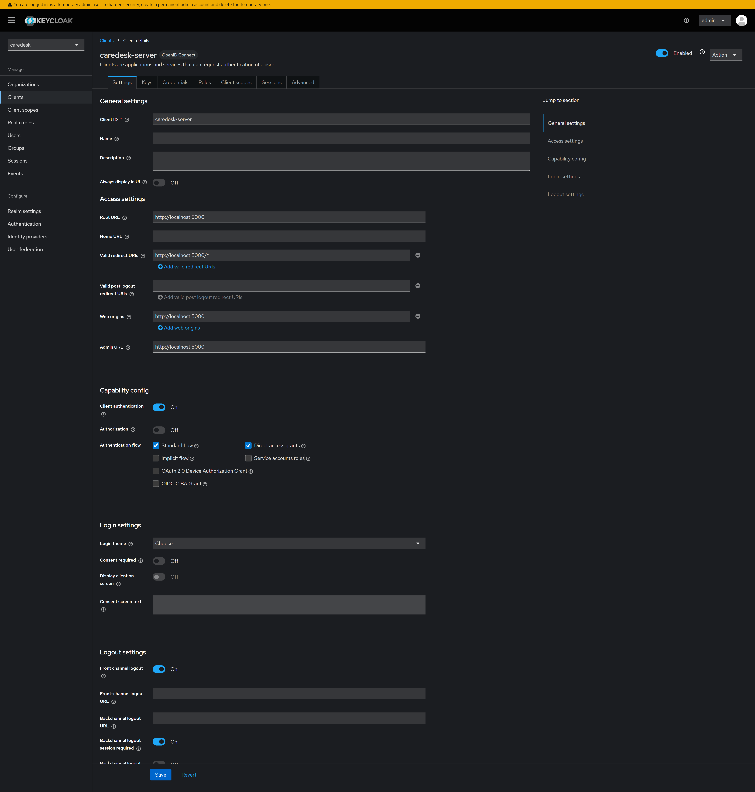
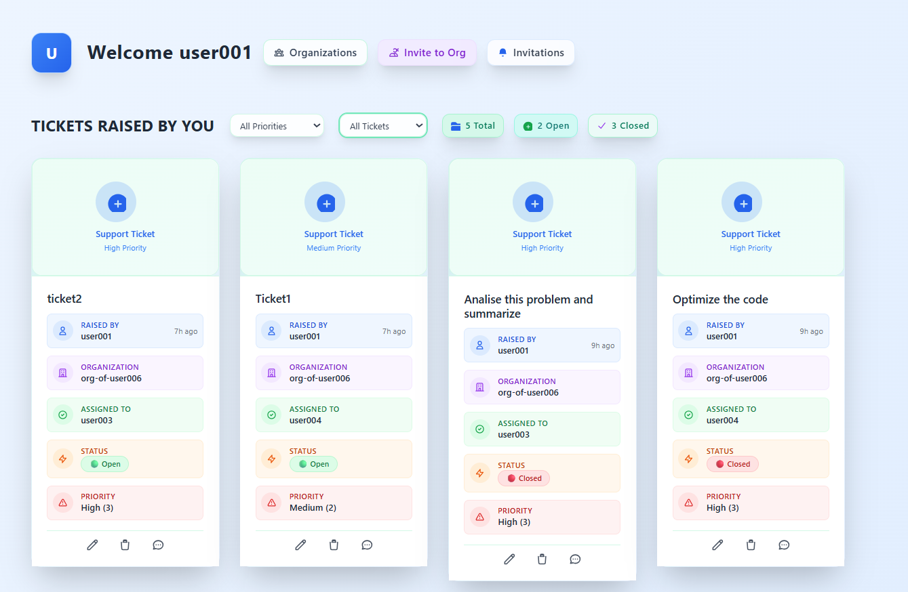
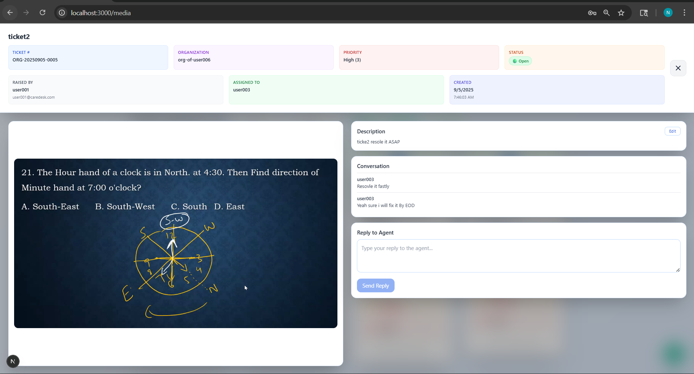
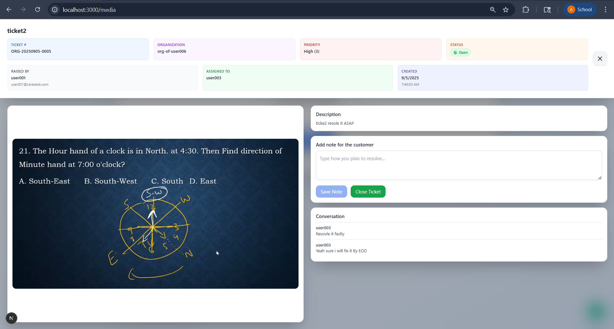
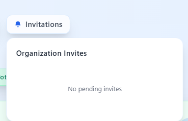
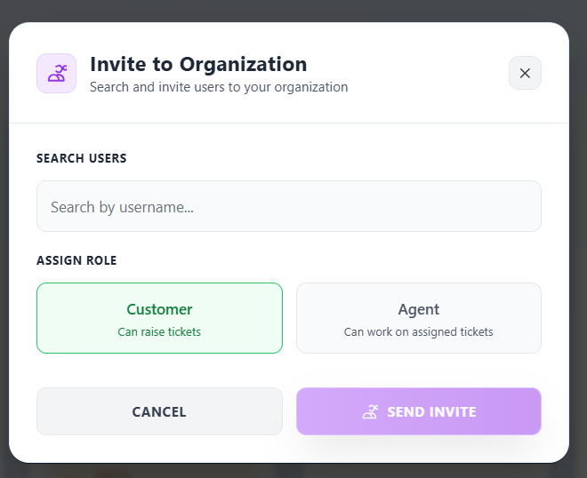
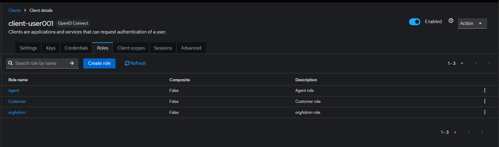
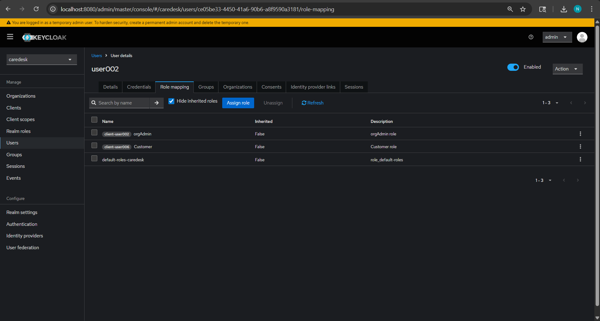
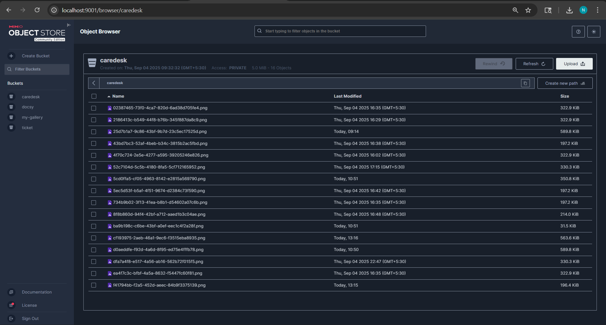

<p align="center">
  
</p>

### CareDesk – Multi‑Tenant Support Ticket System

CareDesk is a multi‑tenant support portal where organizations manage customer tickets end‑to‑end. It provides role‑based dashboards for Org Admins, Agents, and Customers; ticket lifecycle management; comments; attachments; and real‑time updates.

Key links
- Overview and deep‑dives: see [ABOUT_PROJECT/README.md](ABOUT_PROJECT/README.md)
- Frontend: `client/` (Next.js)
- Backend: `server/` (Express + PostgreSQL + Redis + RabbitMQ + MinIO)

Project screenshots


Client dashboard showing tickets, navigation, and role‑aware UI.

High‑level server components and dependencies used by the backend.

List of tickets raised by the customer with ticket number, status, and metadata.

Ticket detail view where customers and agents exchange comments and track updates.

Agent panel to add internal notes for the customer and close a ticket.

Pending invitations page where users accept or reject organization invites.

Organization view to invite users and assign them as Agents or Customers.

Keycloak role definitions used by the system (Org Admin, Agent, Customer).

Example of mapping roles to users in Keycloak for tenant‑aware access.

MinIO console showing stored ticket attachments (S3‑compatible object storage).

Core features
- Multi‑tenant, role‑based UI (Org Admin, Agent, Customer)
- Ticket lifecycle: open → in‑progress → resolved → closed
- Conversation on tickets with replies and history
- File attachments stored in MinIO with secure presigned URLs
- Auto‑assignment to agents (Round‑Robin or Least‑Active via Redis)
- Background jobs (emails/analytics) via RabbitMQ workers
- Real‑time updates using Socket.IO

Tech stack
- Next.js (client), Express/Node.js (server)
- Keycloak for authentication/authorization
- PostgreSQL for core data
- Redis for agent assignment queues
- RabbitMQ for async jobs
- MinIO (S3‑compatible) for attachments

Repository structure
```
caredesk/
  client/            # Next.js app (UI)
  server/            # Express API, Socket.IO, routes
  docker/            # Compose for Postgres, Redis, RabbitMQ, MinIO, Mongo (dev)
  ABOUT_PROJECT/     # Architecture and technology docs
  README.md
```

Getting started
1) Start infra (dev):
```bash
cd docker
docker-compose up -d
```
2) Backend:
```bash
cd ../server
npm install
npm run dev
```
3) Frontend:
```bash
cd ../client
npm install
npm run dev
```

Default ports
- Client: http://localhost:3000
- API: http://localhost:5000
- MinIO console: http://localhost:9001 (minioadmin/minioadmin)
- Keycloak: http://localhost:8080 (if enabled locally)

Documentation
- Start at [ABOUT_PROJECT/README.md](ABOUT_PROJECT/README.md) for detailed explanations.
- Frontend details: [ABOUT_PROJECT/Nextjs.md](ABOUT_PROJECT/Nextjs.md)
- Authentication and roles: [ABOUT_PROJECT/Keycloak.md](ABOUT_PROJECT/Keycloak.md)
- Database (PostgreSQL): [ABOUT_PROJECT/PostgreSQL.md](ABOUT_PROJECT/PostgreSQL.md)
- Redis queues: [ABOUT_PROJECT/Redis.md](ABOUT_PROJECT/Redis.md)
- RabbitMQ workers: [ABOUT_PROJECT/RabbitMQ.md](ABOUT_PROJECT/RabbitMQ.md)
- MinIO attachments: [ABOUT_PROJECT/MinIO.md](ABOUT_PROJECT/MinIO.md)
- Architecture overview: [ABOUT_PROJECT/Architecture.md](ABOUT_PROJECT/Architecture.md)
- System design & scaling: [ABOUT_PROJECT/System-Design.md](ABOUT_PROJECT/System-Design.md)

